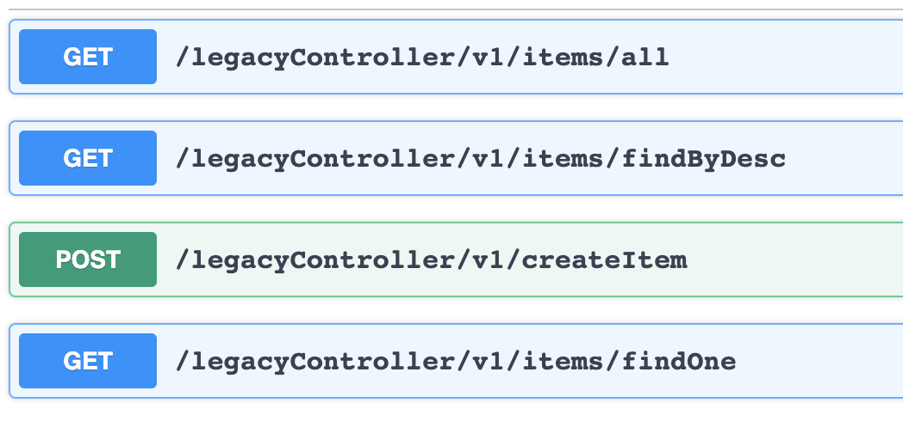
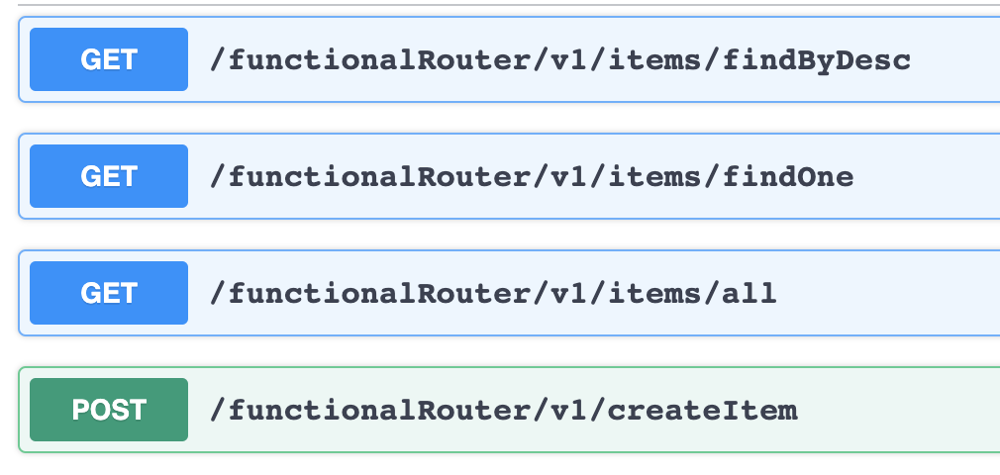
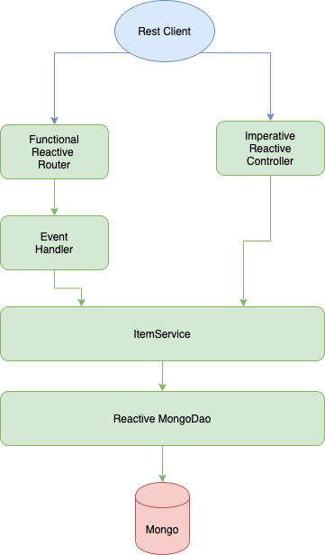

# Simple Reactive Project 

Simple Reactive Client And Server With Spring Webflux and Reactive MongoDB

# 1. Simple Reactive Crud Api (Server)

## Api Documentation

### LegacyController:

https://app.swaggerhub.com/apis/baturayucer/reactive-item-api/0.1

### FunctionalRouter:

https://app.swaggerhub.com/apis/baturayucer/reactive-item-api-functional-router/0.1

## Design

## Installation

* brew tap mongodb/brew

* brew install mongodb-community@4.2

* brew services start mongodb-community@4.2

* git clone https://github.com/baturayucer/simple-reactive-crud-api.git

* mvn clean install

- java -jar target/simple-reactive-crud-api-0.0.1-SNAPSHOT.jar