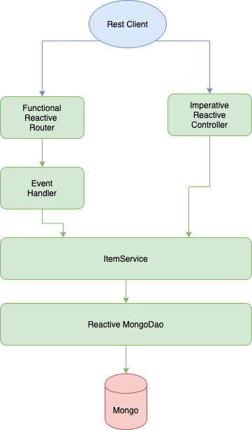

# Simple Reactive Crud Api
Reactive Crud Api With Spring Webflux and Reactive MongoDB

##Installation

* brew tap mongodb/brew

* brew install mongodb-community@4.2

* brew services start mongodb-community@4.2

* git clone https://github.com/baturayucer/simple-reactive-crud-api.git

* mvn clean install

- java -jar target/simple-reactive-crud-api-0.0.1-SNAPSHOT.jar

##Design

